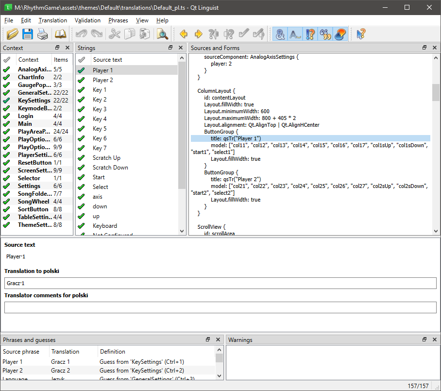

# Translating the game

Translations are theme-specific.
The C++ part of the game does not contain any translatable strings.

In a theme, translatable string come in two forms:
- Theme settings strings (used only in the settings screen)
- Strings in QML files

## Theme settings strings

Those are quite straightforward.
If you take a look at [the json file](assets/themes/Default/settings/k7.json)
defining the settings for the k7 screen, you will notice that the name and description
of each setting are defined in the file itself.
Simply add new languages next to "en" and "pl" (English and Polish).

The identifier of the language can be either a two-letter ISO 639-1 code (e.g. "fr" for French, "zh" for Chinese)
or a combination of the ISO 639-1 code and the ISO 3166-1 alpha-2 country code (e.g. "fr_CA" for Canadian French,
"zh_HK" for Traditional Chinese as used in Hong Kong).

---
**NOTE**

Distinguishing between different scripts of the same langauge based on
ISO 15924 identifiers is currently unsupported.
Please use country codes instead if possible.

---

For example, here is a property with an added Canadian French translation:

```json
        {
  "id": "verticalGauge",
  "name": {
    "en": "Vertical Gauge",
    "pl": "Pionowy wskaźnik",
    "fr_CA": "Jauge verticale"
  },
  "description": {
    "en": "Whether the life gauge is vertical (fills upwards).",
    "pl": "Pionowy wskaźnić życia (wypełnia się w górę).",
    "fr_CA": "Si la jauge de vie est verticale (se remplit vers le haut)."
  },
  "type": "boolean",
  "default": false
}
```

To make a language selectable in the game, the theme's `theme.json` file needs to declare it.
This can look like this:

```json
{
  "translations": {
    "en": "translations/Default_en.qm",
    "pl": "translations/Default_pl.qm",
    "fr_CA": ""
  }
}
```

# Translating a theme

The qm file is a compiled Qt translation file. Those are used for translating strings in QML files,
which is explained in the next section. Providing a qm file is optional, you can leave the value empty if
your theme does not contain any translatable strings in QML files.

## Strings in QML files

To mark a string in a QML file as translatable, you need to wrap it in the `qsTr()` function.
An in-depth explanation of how to use it can be found in the
[Qt documentation](https://doc.qt.io/qt-6/i18n-source-translation.html#qml-use-qstr).

For translating strings in QML files, you will need to use the Qt Linguist toolchain.
There are three essential tools:
- `lupdate`: Extracts translatable strings from QML files and creates a `.ts` file.
- `Linguist`: A GUI tool for translators to translate the strings in a `.ts` file.
- `lrelease`: Compiles a `.ts` file into a `.qm` file that can be used by the game.

This repository contains a CMake target called `update_translations` that will run `lupdate` for you for the default theme.
Add your language to `qt_standard_project_setup` in [CMakeLists.txt](CMakeLists.txt) to generate a `.ts` file for it.
There is also a target called `release_translations` that will run `lrelease`
(it also runs automatically when you build the game).

But if you're just a translator who doesn't want to build the game or you're developing your own theme,
you can also run the tools manually in the command line.
You can get them by [installing Qt](https://www.qt.io/download-qt-installer-oss).

Here is what it should look like inside Qt Linguist:


