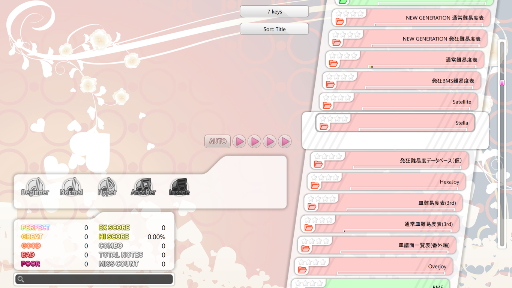
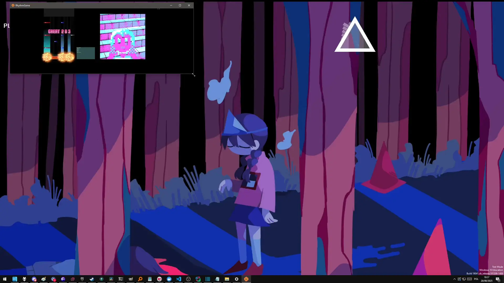
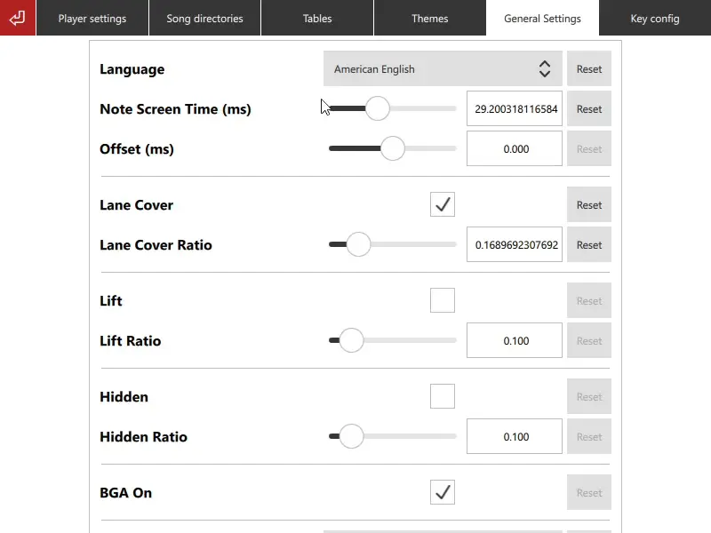

<p align=center>
    <a href="https://github.com/Bobini1/RhythmGame/actions"></a>
    <a href="https://github.com/Bobini1/RhythmGame/blob/master/LICENSE.md"></a>
</p>

# RhythmGame

A customizable, cross-platform BMS player.

## Features

### Customizable themes

Customize the default theme by pressing F2 during gameplay and moving the elements around!


You can also create your own custom theme with [QML](https://doc.qt.io/qt-6/qmlreference.html).
Contact me if you're interested, I can help you get started!
You can use the [default theme](assets/themes/Default) as a reference.

```qml
Text {
    id: titleText

    anchors.bottom: artistText.top
    anchors.horizontalCenter: parent.horizontalCenter
    font.pixelSize: 40
    text: title.title + (title.subtitle ? (" " + title.subtitle) : "")
}
```

### Rules based on Lunatic Rave 2

The timing windows and gauges match Lunatic Rave 2/Lr2oraja
so you can compare your scores with those games easily.


### Table support

RHythmGame supports BMS tables natively.
Simply paste a link in settings.



### Smooth scaling

All resolutions supported! Press F11 to toggle fullscreen.



### Translations

RhythmGame supports English and Polish by default.
Contact me if you would like to help translating it to your language!



### A beautiful default theme

Based on the works of [Shimi999](https://github.com/Shimi9999/GenericTheme) and 
[souki202](https://github.com/souki202/my_beatoraja_skin),
RhythmGame's default theme contains all the necessary features to play BMS.


# Building and installing

See the [BUILDING](BUILDING.md) document.

# Contributing

See the [CONTRIBUTING](CONTRIBUTING.md) document.

# Licensing

The project is distributed under the [MIT license](LICENSE.md).
