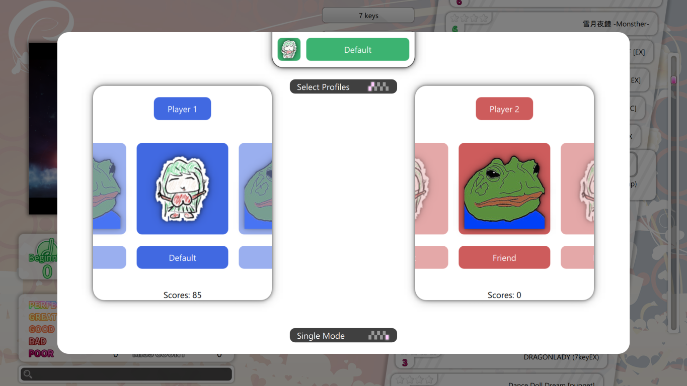
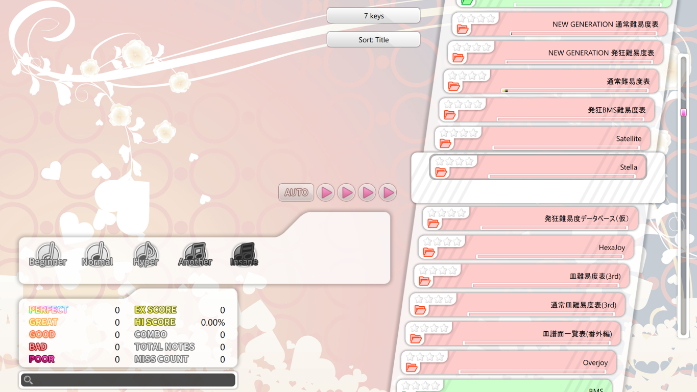
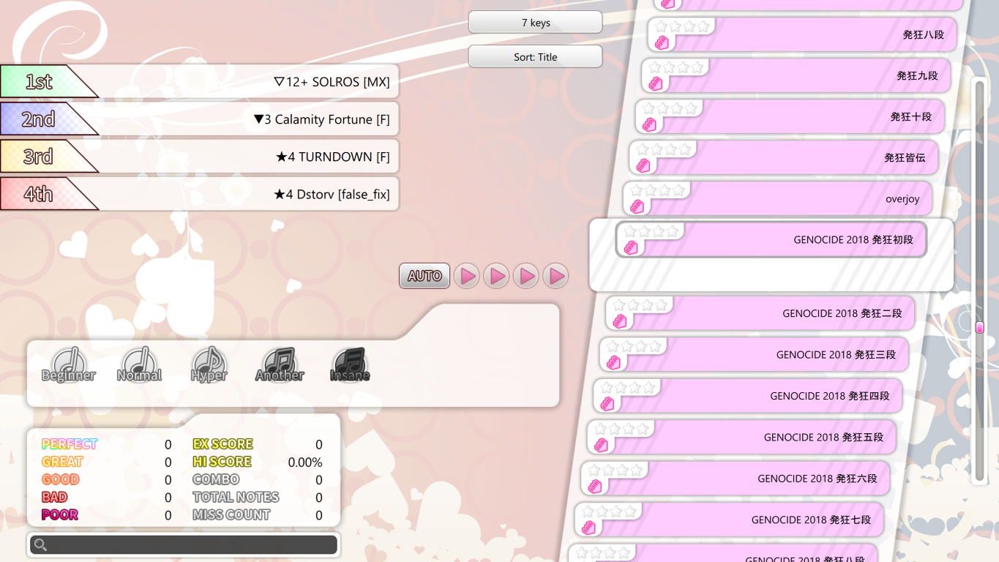
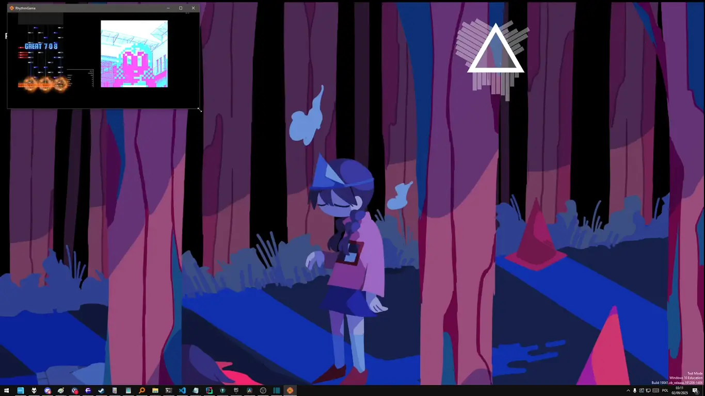
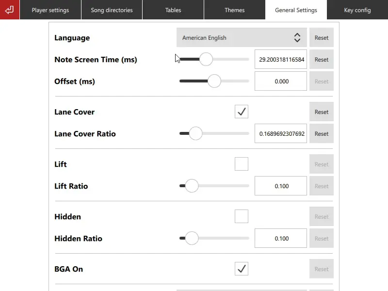
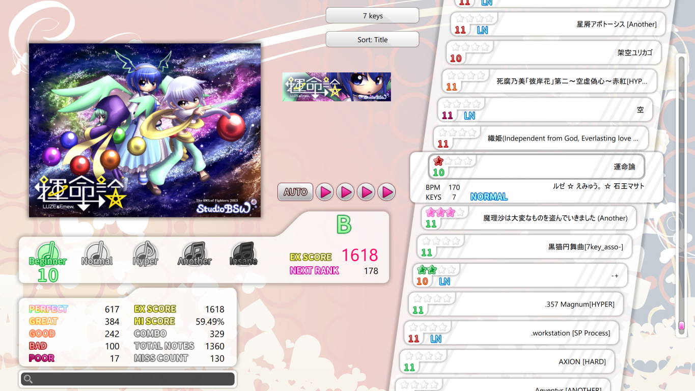
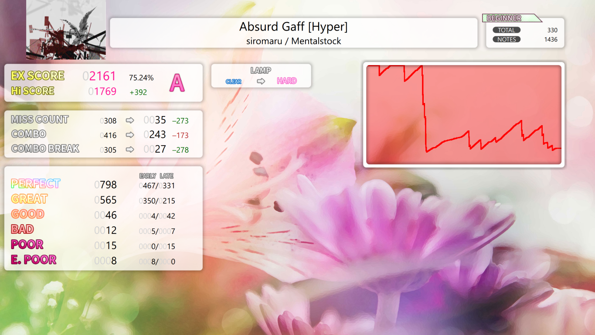

    
    
    </a>
    
     
    

# RhythmGame

A customizable BMS player for Windows and Linux.

New to BMS? Check out w's [Beatoraja English Guide](https://github.com/wcko87/beatoraja-english-guide/wiki/BMS-Overview)
to learn about BMS and how to find songs to play.

## Features

### Customizable themes

Customize the default theme by pressing F2 during gameplay and moving the elements around!

You can also create your own custom theme with [QML](https://doc.qt.io/qt-6/qmlreference.html).
Contact me if you're interested, I can help you get started!
You can use the [default theme](https://github.com/Bobini1/RhythmGame/tree/master/data/themes/Default) as a reference.
See the [DEV_THEME.md](DEV_THEME.md) document for more information.

### Rules based on Lunatic Rave 2

The timing windows and gauges match Lunatic Rave 2/Lr2oraja
so you can compare your scores with those games easily.

### Local battle mode

Play with a friend! Press start twice in song select to enable battle mode.

### Table support

RhythmGame supports BMS tables natively.
Simply paste a link in settings.

### Smooth scaling

All resolutions supported! Press F11 to toggle fullscreen.

### Translations

RhythmGame supports English and Polish by default.
Contact me if you would like to help translating it to your language!

### A beautiful default theme

Based on the works of [Shimi999](https://github.com/Shimi9999/GenericTheme) and 
[souki202](https://github.com/souki202/my_beatoraja_skin),
RhythmGame's default theme contains all the necessary features to play BMS.

### Asynchronous scanning of the song library

RhythmGame scans your song library in the background,
so you can start playing immediately!

# Building and installing

See the [DEV_ENGINE](DEV_ENGINE.md) document.

# Contributing

See the [CONTRIBUTING](CONTRIBUTING.md) document.

# Licensing

The project is distributed under the [MIT license](LICENSE.md).
