

    
    
    
    
    
     
    
    

# RhythmGame

[English](README.md) | [简体中文](README.zh-CN.md) | [日本語](README_ja.md) | [Español](README_es.md)

一款可自定义的BMS播放器，在Windows 和 Linux 运行。

刚接触BMS？ 查看 [Beatoraja English Guide](https://github.com/wcko87/beatoraja-english-guide/wiki/BMS-Overview)
以了解BMS及如何寻找谱面并游玩。

## 功能

### 自定义主题

在游戏过程中按 F2 键可以自定义默认主题，同时还可以自由调整各个元素的位置！

你也可以使用 [QML](https://doc.qt.io/qt-6/qmlreference.html) 来创建自己的主题。
如果你感兴趣可以联系我，我会帮你开始主题的创建。
你可以用 [default theme](https://github.com/Bobini1/RhythmGame/tree/master/share/RhythmGame/themes/Default) 作为参考。
见 [DEV_THEME.md](DEV_THEME.md) 文档以了解更多信息。

游戏还支持基于CSV的 Lunatic Rave 2 和 Beatoraja 皮肤。

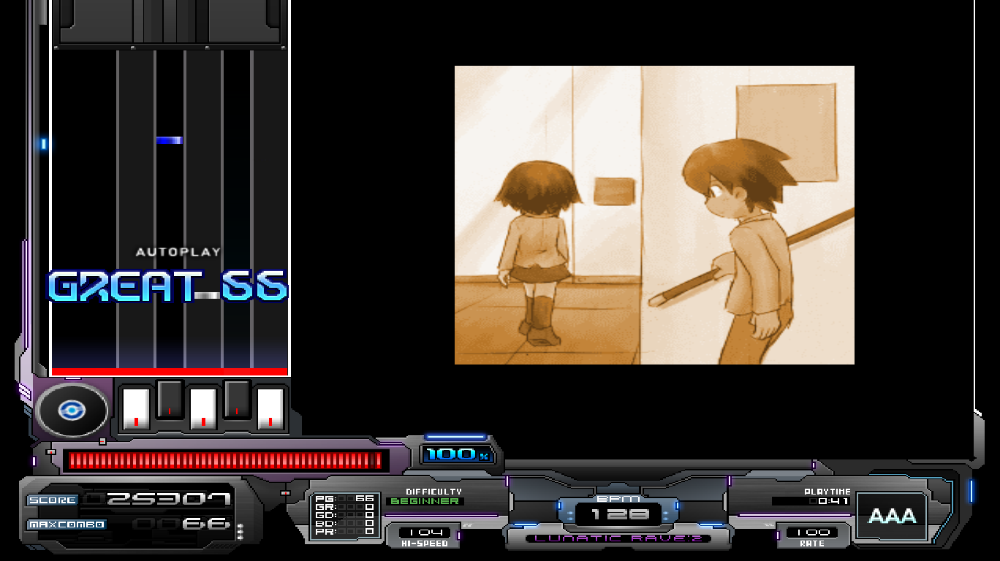]

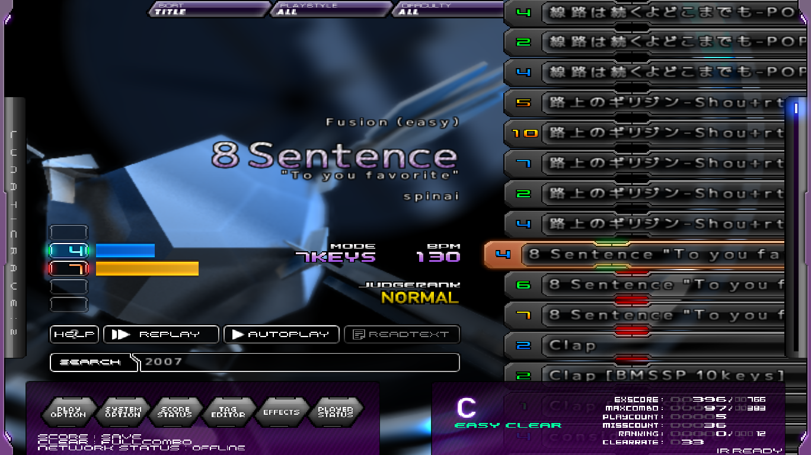

### 网络排行榜（支持 Bokutachi 和 LR2IR）

与世界各地的玩家竞争吧！RhythmGame 平台拥有自己的本地 IR 服务器，地址为https://rhythmgame.eu,
你也可以上传成绩至 [Bokutachi](https://boku.tachi.ac/) 并在 [Lunatic Rave 2 Internet Ranking](http://www.dream-pro.info/~lavalse/LR2IR/search.cgi) 查看。

[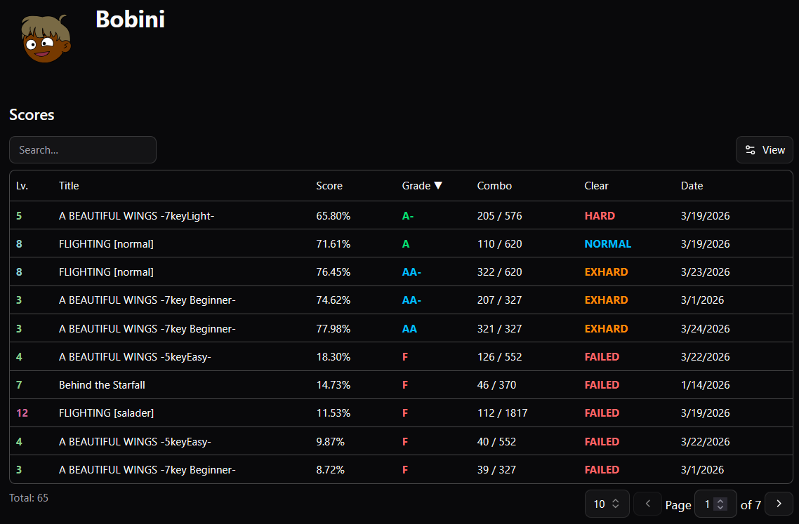](https://rhythmgame.eu)

|                        排名                        |                        在线统计                         |
|:--------------------------------------------------:|:-------------------------------------------------------:|
| 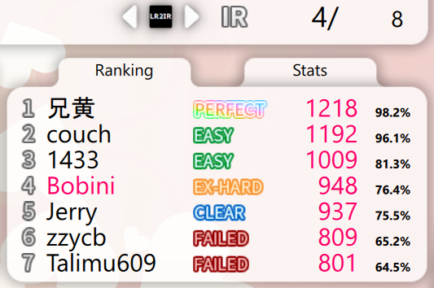 | 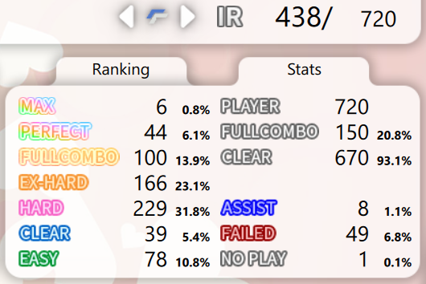 |

### 基于 Lunatic Rave 2 的规则

时间窗口与 Lunatic Rave 2/Lr2oraja 一致，
你可以与其比较分数。

### 本地对战

和朋友一起玩吧！在选择歌曲时点击两次开始键，即可进入对战模式。

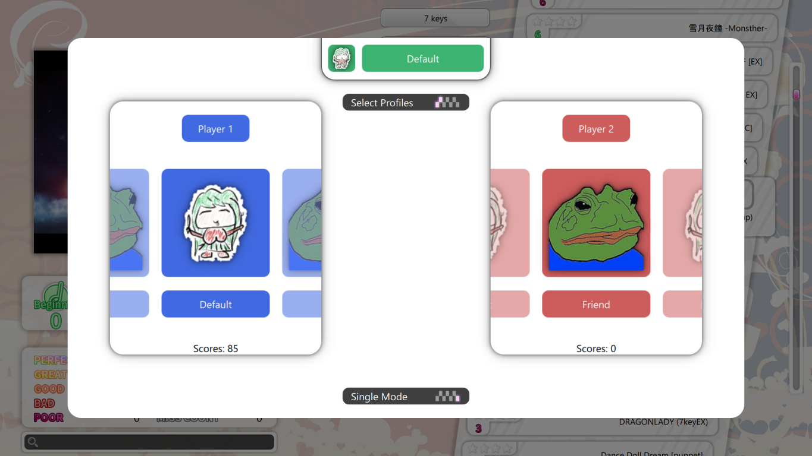

### 支持难度表

RhythmGame 原生支持BMS难度表。
在设置里粘贴链接即可。

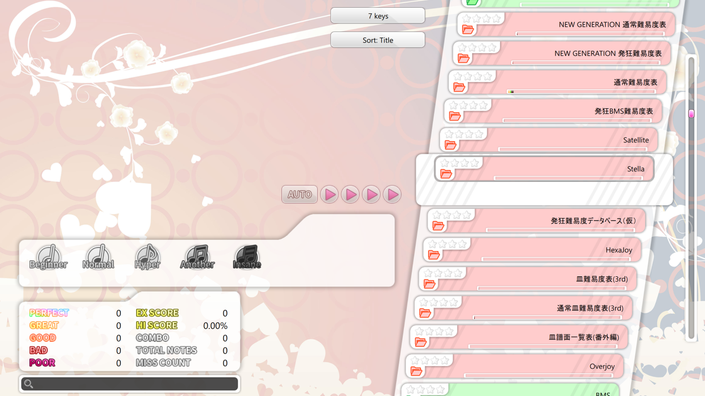

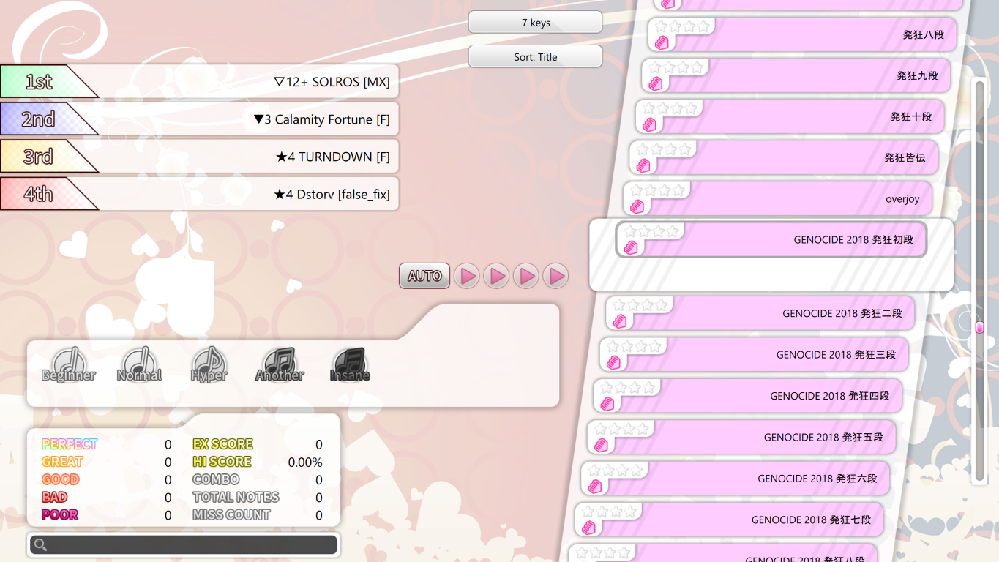

### 平滑缩放

支持所有分辨率，按F11进入全屏。

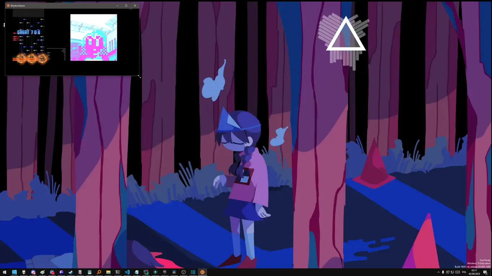

### 多语言支持

RhythmGame 默认支持英语、波兰语和简体中文。
如果你想帮助翻译成其他语言，欢迎联系我！

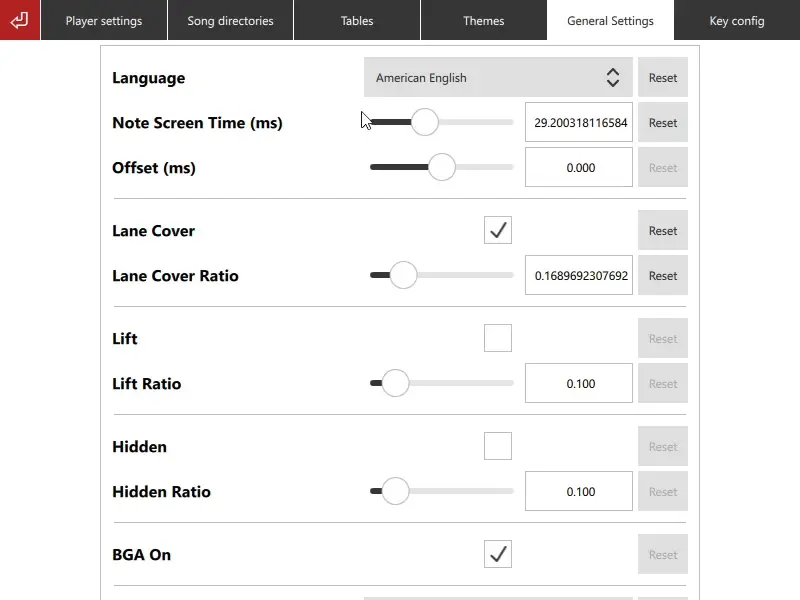

### 精美的默认主题

基于 [Shimi999](https://github.com/Shimi9999/GenericTheme) 和 [souki202](https://github.com/souki202/my_beatoraja_skin) 的作品，
RhythmGame 的默认主题包含了游玩 BMS 所需的所有必要功能。

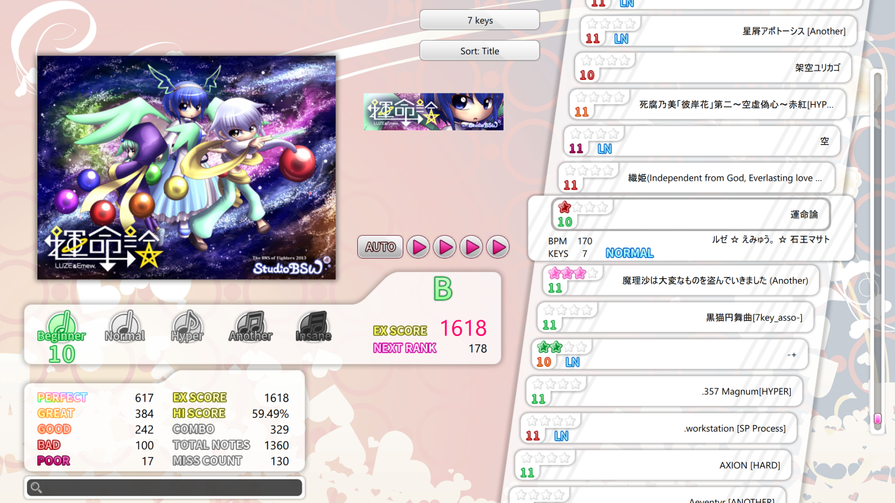

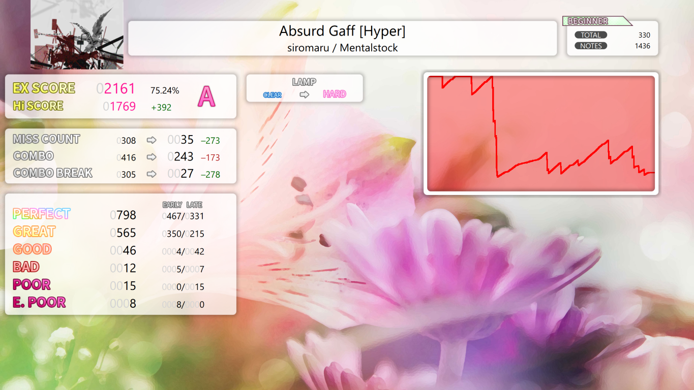

### 异步扫描歌曲库

RhythmGame 会在后台扫描你的歌曲库，
因此你可以立即开始游玩！

# Building and installing

See the [DEV_ENGINE](DEV_ENGINE.md) document.

# Contributing

See the [CONTRIBUTING](CONTRIBUTING.md) document.

# Licensing

The project is distributed under the [MIT license](LICENSE.md).
