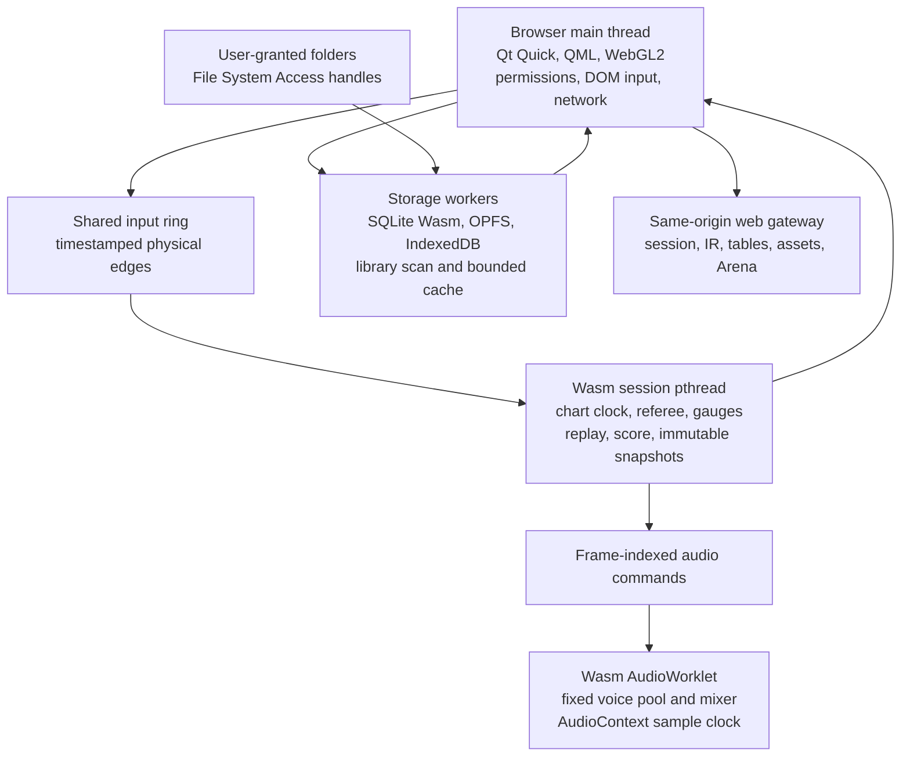

# RhythmGame Chromium WebAssembly port design

## Status

This document is the approved production architecture and verification roadmap
for a Chromium-first WebAssembly edition of RhythmGame hosted by
`rhythmgame.eu`. It preserves the user-visible capabilities of the native
application while replacing operating-system services with browser or
same-origin server implementations.

The architecture is approved for gated engineering. The Qt licensing decision
remains unresolved, so implementation may proceed through the reproducibility
and combined-capability probes only. Broader product porting begins after Gate 0
records the commercial-Qt or GPLv3-compliant distribution route.

## Outcome

An Emscripten build is feasible, but it is not a compiler-preset conversion.
RhythmGame currently assumes a synchronous native filesystem, process-owned
SQLite connections, blocking worker coordination, a native credential vault,
SDL event waiting, a miniaudio output device, Vulkan, and a conventional Qt
event-loop lifetime. Browsers deliberately provide different contracts for
these services.

The production web edition will:

- retain the existing C++ chart, scoring, gauge, replay, Arena, and skin
  semantics;
- retain the Qt Quick/QML presentation and translations;
- retain Default, LR2, Beatoraja, and user-provided QML theme support;
- provide user-authorized local library scanning without uploading private song
  libraries;
- persist profiles, scores, replays, configuration, and a rebuildable song
  catalog;
- provide keyboard, WebHID, WebMIDI, and general gamepad input according to a
  qualified device support matrix;
- use a low-jitter AudioWorklet path for keysounds;
- use a same-origin server gateway for login, Internet Ranking, tables, assets,
  and Arena;
- remain a normal native application on existing desktop targets.

No platform adapter may silently report success while omitting behavior.
Unavailable permissions, codecs, devices, storage, or network services must be
represented as explicit recoverable states with a parity-preserving fallback or
a release-blocking gap.

## Product assumptions

- Chromium desktop is the first supported browser family.
- Windows 11 is the first qualification operating system. Linux and macOS
  Chromium follow after the same automated gates pass.
- The application has a permanent canonical origin. The recommendation is
  `https://play.rhythmgame.eu/`; the origin must be finalized before real user
  data is stored because OPFS, IndexedDB, directory handles, permissions, and
  service workers are origin-bound.
- The website can provide HTTPS, response headers, authenticated API endpoints,
  reverse proxies, WebSocket endpoints, static asset versioning, and a service
  worker.
- One tab owns gameplay, input, audio, and the database. Additional tabs show a
  follower screen rather than opening persistent state concurrently.
- Users explicitly authorize library, theme, replay, BGM, and soundset folders.
- A visible start flow may request audio, fullscreen, directory, HID, output
  device, and persistent-storage permissions because browsers require user
  gestures for those actions.
- Feature parity means equivalent observable behavior. It does not require
  retaining an unavailable OS mechanism such as QtKeychain or absolute native
  paths.

## Non-goals

- Non-Chromium browser support is not part of the first release.
- Mobile and touch-only gameplay are not part of the first release.
- The browser does not gain unrestricted access to the user's filesystem.
- Song libraries are not bulk-copied into browser storage.
- Private user media is not uploaded for decoding.
- Qt WebAssembly dynamic linking is not used in production.
- A non-threaded artifact is not presented as a ranked low-latency equivalent.

## Licensing gate

RhythmGame is MIT-licensed, while Qt for WebAssembly is currently offered under
commercial terms or GPLv3. The deployed application statically links Qt and is
downloaded by site visitors. Before engineering proceeds beyond reproducibility
probes, the project must record one of these decisions:

1. use an appropriate commercial Qt license; or
2. distribute the combined WebAssembly application in a GPLv3-compliant manner,
   including the required source and license delivery.

This is a release gate and should be reviewed by the project's legal owner. It
is not resolved by the technical design. The decision also triggers a
target-specific SPDX/license closure for every statically linked library, codec
and patent-bearing feature, font, built-in theme, Qt patch, generated worker,
and software media fallback. Gate 0 must produce a prototype distribution
bundle containing the applicable notices, Corresponding Source, exact build
scripts, patches, and toolchain provenance. Unknown or incompatible licensing
blocks the dependency before broad porting.

Primary reference: [Qt for WebAssembly licensing and platform
requirements](https://doc.qt.io/qt-6/wasm.html).

## Current native assumptions that block a direct build

| Native assumption | Current evidence | Web consequence |
|---|---|---|
| Conventional Qt lifetime | `src/main.cpp` stack-owns long-lived objects and returns `app.exec()` | `QApplication::exec()` is unsupported with native Wasm exceptions; the web runtime must be heap-owned and `main()` must return |
| Vulkan renderer | `src/main.cpp` forces Vulkan | Web target must select Qt Quick WebGL2 and the basic render loop |
| Blocking coordination | Nested `QEventLoop::exec()`, `waitForDone()`, `waitForFinished()`, blocking queued calls, and thread joins exist | Browser main-thread blocking can deadlock worker startup and event delivery |
| Native paths | Scanner, themes, media, replay import, and configuration use `QDir`, `std::filesystem`, mappings, and canonical absolute paths | File System Access exposes capabilities and relative entries, not durable absolute paths |
| Desktop SQLite | SQLiteCpp opens ordinary filesystem databases with WAL and process threads | Persistent browser SQLite requires an OPFS worker, asynchronous calls, explicit durability, and cross-tab ownership |
| OS credential vault | QtKeychain stores a bearer token | Browser login should use a server-owned Secure HttpOnly session cookie |
| Native input loop | Windows hooks/native scan codes and SDL's blocking gamepad event thread | Browser adapters must use timestamped Keyboard, WebHID, and Gamepad events |
| Native audio device | miniaudio owns the output callback at a fixed 44.1 kHz profile | Browser audio requires a user gesture and an AudioWorklet using the context's actual sample rate |
| Native media graph | Qt Multimedia with FFmpeg, local file URLs, OpenImageIO DDS, and SDL2_image TGA | The Emscripten dependency graph rejects FFmpeg and browser media has codec and source limitations |
| Native service access | Direct remote HTTP, WebSocket authorization, table URLs, and redirects | HTTPS mixed-content, CORS, COEP, cookie, and browser WebSocket constraints require a same-origin gateway |
| Target dependency graph | The root vcpkg manifest pulls target Qt, FFmpeg multimedia, InterfaceFramework, QtKeychain, TBB, LLFIO, and OpenImageIO | A web-specific dependency graph and platform adapters are required |

The repository's current `dev-wasm` preset is not a valid starting point. It
references Qt 6.9.0, requests a non-existent shared-Qt Emscripten triplet, and
allows host packages to leak into target discovery. The locally active
Emscripten 3.1.70 also does not match Qt 6.11.1's required 4.0.7 toolchain.

## Production architecture



The principal timing rule is:

> Neither `QTimer`, `requestAnimationFrame`, nor a QML animation owns gameplay
> time. Input occurrence time owns judgement, the AudioContext sample-frame
> timeline owns playback, and QML renders immutable snapshots.

The principal platform rule is:

> Domain code requests capabilities from deep modules. Native, web, and fake
> adapters implement those modules. Browser APIs and `#ifdef __EMSCRIPTEN__`
> branches do not spread through gameplay and presentation code.

## Deep module boundaries

Every platform module has at least a native adapter, a web adapter, and a
deterministic fake used by tests.

### `AppRuntime`

`AppRuntime` owns the lifetime and startup state machine. It is an orchestrator,
not a general service locator.

Responsibilities:

- construct and retain `QGuiApplication`, QML engines, managers, workers, and
  platform modules after `main()` returns;
- publish bootstrap phases and recoverable failures to QML;
- wait for persistent storage initialization before opening repositories;
- wait for an explicit browser gesture before starting audio or permission
  requests;
- acquire the single-active-tab lock before migration or database open;
- stop scanning and reach a gameplay-ready resource state before starting a
  chart;
- coordinate version mismatch, visibility loss, device loss, and safe shutdown.

The web entry point allocates this runtime, begins asynchronous initialization,
and returns `0`. No destructor is relied upon at page termination.

### `AppStorage`

`AppStorage` owns application data, durability, backup, and cache policy.

Conceptual operations:

```cpp
QFuture<StorageOpenResult> open();
QFuture<void> checkpoint(DurabilityClass durability);
QFuture<BackupArtifact> exportUserData();
QFuture<RestoreResult> restoreUserData(BackupArtifact artifact);
StorageHealth health() const;
```

Invariants:

- an acknowledged score bundle is wholly durable or wholly absent;
- catalog loss never destroys profile, score, replay, or configuration data;
- database VFS selection is versioned and never changes implicitly;
- the active database is never replaced before validation succeeds;
- a second tab never initializes the single-owner VFS;
- OPFS is described as persistent storage, not as a backup.

### `LibraryWorkspace`

`LibraryWorkspace` owns directory authorization, identity, scanning, path
resolution, and selected working sets.

Conceptual operations:

```cpp
QFuture<LibraryAuthorization> authorize(LibraryKind kind);
QFuture<ScanResult> scan(LibraryId library, ScanOptions options);
QFuture<MaterializedLease> materialize(AssetManifest manifest);
QFuture<RelinkResult> relink(LibraryId library);
```

Invariants:

- a library is identified by an opaque UUID and relative path components, never
  by a browser-invented absolute path;
- every resolved path remains under its authorized root;
- a failed or cancelled scan cannot remove the last successful catalog;
- enumeration order is not meaningful;
- materialization is bounded to a chart, replay import batch, soundset, BGM set,
  or complete selected theme;
- an active chart retains a lease preventing eviction of its assets;
- content hashes, rather than size and modification time, determine identity;
- permissions are revalidated after reload and re-requested only from a user
  gesture.

### `InputSource`

`InputSource` produces a single physical input event model:

```cpp
struct InputEdge {
    InputSourceKind source;
    PhysicalControl physical;
    bool pressed;
    float value;
    std::int64_t browserReceiptUs;
    std::optional<std::int64_t> deviceOccurrenceUs;
    std::int64_t handlerUs;
    TimestampQuality timestampQuality;
    std::uint64_t sequence;
};
```

Invariants:

- `browserReceiptUs`, `deviceOccurrenceUs` when present, and `handlerUs` are
  normalized into the Window performance-time-origin domain;
- the source and `timestampQuality` state whether the timestamp represents a
  device occurrence, browser receipt, polling update, or handler observation;
- sequence order is preserved across the shared ring;
- repeat keyboard events do not create additional presses;
- logical device assignment is explicit; ambiguous duplicate exposure through
  keyboard, HID, MIDI, or Gamepad pauses or unranks rather than guessing;
- queue overflow, disconnect, blur, hidden-page transition, and fullscreen loss
  synthesize releases and pause or unrank the session;
- mapping, release debounce, analog scratch, and logical BMS controls remain in
  the existing `InputTranslator` domain.

### `GameplaySession`

`GameplaySession` owns the deterministic chart clock, referee, gauges, replay,
score state, and audio-command scheduling on a dedicated Wasm pthread.

Invariants:

- identical chart state and timestamped inputs produce equivalent native and
  Wasm results;
- the worker never waits on the browser main thread;
- snapshots sent to QML are immutable and sequence-numbered;
- a late presentation frame does not change judgement;
- a clock discontinuity or audio state change pauses safely;
- scanning, decoding, and networking cannot execute in the real-time callback.

The native adapter may initially execute the same engine on its existing thread
model, but both platforms consume the same timestamped input and clock
contracts.

### `AccountSession` and `RemoteServices`

These modules own login/session restoration and application-level remote
operations. Domain callers request login, score synchronization, table fetches,
LR2IR/Bokutachi/Tachi operations, and Arena connections without handling
browser cookies or proxy URLs.

Invariants:

- bearer credentials are never placed in localStorage, OPFS, QML properties,
  logs, or replay exports;
- authenticated mutations use a server session, CSRF protection, and exact
  Origin validation;
- arbitrary third-party table or image URLs are fetched only by a bounded,
  SSRF-hardened server gateway;
- Arena uses WSS and its existing application heartbeat, not WebSocket ping
  frames unavailable to browser clients.

### `ThemeHost`

`ThemeHost` retains built-in QML, user-provided QML, LR2, and Beatoraja
presentation behavior while narrowing platform authority.

Arbitrary user QML loaded into the application's QML engine is trusted
plugin-equivalent code, as it is in the native application. It is not a
sandbox, and HttpOnly cookies, CSP, or a custom network manager do not turn it
into one. Full compatibility mode therefore requires an explicit trust warning
bound to the imported theme identity and version.

Invariants:

- all theme paths are rooted and component-validated;
- same-engine custom QML is loaded only after an explicit plugin-equivalent
  trust decision;
- session credentials and storage-worker handles are never exposed to QML;
- the QML network access manager denies arbitrary direct remote access and
  routes supported theme assets through the bounded application gateway;
- themes receive a documented presentation façade rather than database and
  transport implementations;
- includes, recursion, asset sizes, decoded dimensions, and allocation budgets
  are bounded;
- a failing custom theme cannot replace the last working theme configuration.

The object/interface and URL-policy audit reduces accidental authority and
protects credentials, but it does not claim hostile-QML containment. An
untrusted-theme mode requires an isolated renderer origin running a separate Qt
theme renderer without cookies or persistent app storage and exchanging only
sanitized snapshots and commands with the parent. That isolation is a distinct
security feature; it cannot silently replace trusted compatibility mode until
the real custom-theme corpus proves equivalent behavior.

## Toolchain and build design

### Exact production pins

- Qt: `6.11.1`
- Emscripten: `4.0.7`
- SQLite Wasm: `3.53.3`
- Qt source archive SHA-256:
  `252acef8c5ae68074d91cadba2ee4a83465051bbb970dd26e8f0daa0f3904e03`
- Existing qtdeclarative stacking patch SHA-256:
  `2A015242AF462BE117A2924D4D8DB2C753B29891921E714C23BF1AB4355C4C50`
- vcpkg baseline: `a0400024711b283056538ac19ced80b91a83c24c`, with
  repository-owned target and host triplets, a pinned Emscripten chainload
  wrapper, and repository-owned Qt Wasm port customization.
- Browser automation: pinned Playwright Chromium plus Chrome Stable and Beta
  qualification lanes.

Qt requires applications to use the matching Emscripten toolchain because
cross-version ABI compatibility is not guaranteed.

### Vcpkg-managed custom Qt target

Vcpkg owns the official Qt source fetch, host/target dependency graph, patching,
package ABI, binary cache, installation, and exported CMake packages. A native
host triplet builds the same-version `moc`, QML, translation, and shader tools;
the Emscripten target triplet builds static Qt libraries. Apply the repository's
qtdeclarative patch to the target source.

The stock root manifest is not the web manifest. The target triplet and Qt
customization enable the required Wasm features, preserve Qt's exact Emscripten
version check, and fail closed on a different compiler. A full
baseline-derived `qtbase` overlay owns the Qt feature configuration and restores
the version check removed by the baseline port's Emscripten packaging
workaround. A separately built Qt SDK is only a fallback if Gate 1 proves the
vcpkg route unmaintainable.

Required target features:

```text
-release
-static
-platform wasm-emscripten
-feature-thread
-feature-wasm-exceptions
-feature-wasm-jspi
```

Build Qt Base, Declarative, ShaderTools, ImageFormats, SVG, WebSockets, and the
Wasm Multimedia backend used only for qualified video paths. Enable
`-feature-wasm-simd128` after an A/B build demonstrates a benefit without
changing correctness.

Every C++ target and static dependency must consistently use:

```text
compile and link: -pthread -fwasm-exceptions
application link: -sJSPI
audio application link: -sAUDIO_WORKLET=1 -sWASM_WORKERS=1
```

Bring-up also sets:

```text
-sPTHREAD_POOL_SIZE=4
-sPTHREAD_POOL_SIZE_STRICT=2
-sALLOW_BLOCKING_ON_MAIN_THREAD=0
```

The final worker count is selected from trace evidence and bounded independently
of unrestricted `navigator.hardwareConcurrency`.

Emscripten's Wasm AudioWorklet runs as a Wasm Worker rather than a pthread. The
build and deployment manifest therefore treats Qt pthread workers, Wasm
Workers, the generated `.aw.js` AudioWorklet bootstrap, shared Wasm memory, and
the main module as one qualified combination. The first probe must exercise
creation, shared-ring access, memory growth, teardown, CSP/COEP loading, and
version matching across all of them.

JSPI is the initial parity bridge for existing nested event loops. It avoids
Asyncify's broad transformation cost, but it is not permission to retain
blocking architecture indefinitely. Each nested event loop and synchronous wait
is migrated to a real asynchronous state transition. An Asyncify artifact may
exist only for diagnosis.

Qt Quick uses WebGL2 and the basic render loop. Production uses one statically
linked application because Qt WebAssembly dynamic linking is Technology
Preview, and threaded dynamic linking is not a production combination.

Primary references:

- [Qt for WebAssembly](https://doc.qt.io/qt-6/wasm.html)
- [Emscripten pthreads](https://emscripten.org/docs/porting/pthreads.html)
- [Emscripten native Wasm exceptions](https://emscripten.org/docs/porting/exceptions.html)
- [Emscripten asynchronous code and JSPI](https://emscripten.org/docs/porting/asyncify.html)
- [V8 JSPI status](https://v8.dev/blog/jspi)

### Web-specific dependency graph

The web target uses a dedicated manifest rather than conditionally trimming the
native root manifest during package resolution.

| Dependency or module | Web route |
|---|---|
| Qt Core, GUI, QML, Quick, SVG, Concurrent, Network, WebSockets, ShaderTools | Vcpkg-managed custom static Qt target |
| Qt InterfaceFramework | Replace the project's `QIfPendingReply` usage with an application-owned asynchronous QML result |
| QtKeychain | Remove from the web link graph; use `AccountSession` with an HttpOnly server session |
| Qt Multimedia FFmpeg feature | Remove from the web manifest; qualify browser video and private local software fallback paths |
| SQLiteCpp and target SQLite | Retain for native; web persistence uses the selected storage gate outcome |
| LLFIO | Remove from web; `LibraryWorkspace` owns browser files and bytes |
| SDL2 event thread | Retain native; web uses Keyboard, WebHID, and Gamepad adapters |
| SDL2_image | Replace the web-only TGA use with the qualified Qt TGA handler |
| OpenImageIO | Replace the DDS-only web use with a compact, fuzzed DDS decoder |
| TBB | Remove from web because no direct source use was found |
| mimalloc | Begin with Emscripten's allocator; A/B test later |
| miniaudio | Retain mixer/decoders only if corpus tests pass; do not assume its WebAudio device backend |
| libsndfile and codec libraries | Link-probe and corpus-test each format; replace with equivalent decoders only if parity remains |
| fmt, spdlog, Boost headers, lexy, magic_enum, libxml2, zlib-ng, zstd, stb | Build and executable-link probes in the custom triplet |

Community vcpkg Emscripten triplets are not continuously supported like official
platforms. Each leaf dependency therefore needs a compile, link, run, exception,
and representative data probe before entering the application graph.

## Persistence architecture

### Production default

Use the official SQLite Wasm distribution in one dedicated worker and store it
in OPFS through `opfs-sahpool`. Acquire an origin-wide exclusive Web Lock before
the worker initializes SQLite. A second tab remains a follower and cannot open
the database.

This choice deliberately introduces asynchronous repository calls. The official
SQLite JavaScript OPFS VFS does not transparently become the VFS used by
SQLiteCpp compiled inside the Qt Wasm module. Attempting to conceal that
boundary would retain blocking assumptions and use a less-supported storage
path.

Split persistent data into:

- `user.sqlite`: profiles, settings, scores, replay blobs, gauge histories,
  theme configuration, library metadata, and sync state;
- `catalog.sqlite`: rebuildable chart metadata, FTS, histograms, readmes,
  previews, and scan generations;
- IndexedDB: serializable File System handles and small browser capability
  records;
- ordinary OPFS: bounded content-addressed materialization cache, backups being
  prepared, and diagnostic bundles;
- Cache Storage: immutable versioned application assets only.

Consolidate filesystem-selected per-profile databases into profile-keyed tables
in `user.sqlite`. Replace cross-file `ATTACH song_db` assumptions with stable
chart identities and domain-level repository operations.

Expose semantic transactions rather than raw SQL RPC:

```text
saveScoreBundle
saveReplayBundle
loadSongPage
commitScanGeneration
updateProfileConfiguration
prepareConsistentBackup
```

`saveScoreBundle` atomically includes score, replay, gauge history, and sync
outbox state. Catalog metadata and its histograms are also committed in one
transaction.

Initial database policy:

- `foreign_keys=ON`
- `trusted_schema=OFF`
- fixed `application_id`
- `user_version` changes at the end of a successful migration transaction
- rollback journal `DELETE` or `PERSIST`, selected by crash and latency tests
- `synchronous=FULL` for `user.sqlite`
- `synchronous=NORMAL` for rebuildable `catalog.sqlite`

Do not copy the desktop WAL defaults. OPFS WAL adds no concurrency advantage in
the single-owner design and qualifies only if recovery and performance tests
demonstrate a material benefit.

Preallocate and measure the SAH pool. The default six slots are insufficient for
two databases plus journals, temporary files, backup, and restore. Begin tests
at twelve slots, record the high-water mark, and keep non-SQLite cache files
outside the SAH-managed directory.

### Storage decision spike

A bounded compatibility spike may evaluate SQLiteCpp on Emscripten WasmFS OPFS
because it would reduce initial call-site changes. It does not become the
production route merely by compiling. It must match the official worker design
on:

- no loss of acknowledged critical transactions in deterministic kill points;
- integrity after at least 1,000 randomized browser and worker terminations;
- controlled quota failure and recovery;
- reload and browser restart durability;
- migration safety;
- one-tab ownership;
- p95 and p99 transaction latency;
- absence of main-thread blocking;
- current upstream support status.

Failure of any integrity, durability, supportability, or main-thread gate ends
the compatibility experiment. The official SQLite worker remains the default.

If real multi-tab database access later becomes a product requirement, migrate
explicitly to SQLite's `opfs-wl` VFS. Never open one logical database through
different VFS names. A VFS change is a versioned export/import migration.

Primary references:

- [SQLite Wasm persistent storage](https://sqlite.org/wasm/doc/trunk/persistence.md)
- [SQLite 3.53.3 release](https://sqlite.org/releaselog/3_53_3.html)
- [SQLite backup API](https://www.sqlite.org/backup.html)
- [SQLite atomic commit](https://www.sqlite.org/atomiccommit.html)
- [Web Locks](https://w3c.github.io/web-locks/)
- [WHATWG Storage](https://storage.spec.whatwg.org/)

### Durability, backup, and restore

- Request persistent storage after the first meaningful user save and report
  whether it was granted.
- Observe quota estimates and reserve space for critical commits.
- On quota pressure, evict unpinned cache before rejecting a critical write.
- Map generic SQLite I/O failures to a diagnostic that checks quota and storage
  health without falsely declaring corruption.
- Export critical user data through a consistent backup. Do not include the
  rebuildable catalog or cache.
- Directory handles are not portable backup material. Export their display
  metadata and request relinking after restore.
- Restore into an inactive database, migrate, run `integrity_check` and
  `foreign_key_check`, close and flush it, then switch a small active-slot
  manifest.
- Retain the previous healthy database until a subsequent startup succeeds.
- Provide explicit profile, score, replay, configuration, and diagnostic export
  because users can clear site data even when persistence was granted.

## Library scanning and virtual paths

Use `showDirectoryPicker({mode: "read"})` for song libraries and other
read-mostly roots. Store the serializable `FileSystemDirectoryHandle` in
IndexedDB under an opaque library UUID. On startup, query permission and show a
gesture-driven reconnect action when the browser returns `prompt`.

The catalog stores:

```text
library UUID
validated relative path components
content identity
size and modification time hints
scan generation
parser and schema versions
```

It never stores a fabricated native absolute path as identity.

Dedicated scanner workers asynchronously enumerate roots with bounded
concurrency. Chart bytes are transferred to the existing parser through a
`ByteSource` seam. The existing mapped-file entry point in
`ChartDataFactory.cpp` is the initial extraction boundary.

Scanning is generation-based:

1. allocate generation `G`;
2. enumerate and parse into staging rows;
3. batch catalog transactions;
4. record exact failures and cancellation;
5. atomically promote `G` only after traversal, parser jobs, and database writes
   all succeed;
6. sweep rows from older generations after promotion.

An incomplete generation never replaces or clears the last successful catalog.
A `FileSystemObserver`, when available, only marks a root dirty and schedules
validation; it is not a source of truth.

The scanner defines how BMS `#RANDOM` identity behaves. An unchanged content
hash and parser version retains the prior resolved sequence. An explicit
rerandomize action creates a new chart variant identity. Interrupted scans
cannot expose a mixture.

Before gameplay, `LibraryWorkspace` resolves the selected chart's complete
asset manifest and materializes only that working set into a compatibility
directory or byte-source cache. The manifest includes chart, audio, images,
video, readme, and referenced auxiliary files. It is written last, so partial
cache objects are unreachable.

Themes have broader directory semantics. Import and version the complete
selected theme tree, or a proven complete dependency closure, before activation.
This preserves wildcard, include, font, sprite, fallback, and archive behavior
without copying song libraries.

Path handling tests cover CP932 and Shift-JIS names, NFC and NFD, case-only
collisions, Windows-like case-insensitive references, deep paths, reserved
characters, `..`, absolute references, symlink-like external mutations, and
cloud/removable-drive disappearance.

Primary references:

- [File System Access specification](https://wicg.github.io/file-system-access/)
- [WHATWG File System](https://fs.spec.whatwg.org/)
- [Chromium File System Access guidance](https://developer.chrome.com/docs/capabilities/web-apis/file-system-access)
- [Emscripten filesystem APIs](https://emscripten.org/docs/api_reference/Filesystem-API.html)

## Input, clock, and latency design

### Browser input adapters

Keyboard input uses capture-phase `KeyboardEvent.code`, which represents the
physical key rather than the current keyboard layout. Each trusted event is
timestamped at occurrence, repeats are ignored, and the adapter immediately
writes an `InputEdge` to a SharedArrayBuffer ring. Browser defaults are prevented
only for mapped gameplay controls while the game surface is active. Text input
and IME behavior remain available outside gameplay capture.

After a gesture-driven fullscreen transition, request Keyboard Lock for bound
gameplay codes when Chromium exposes it. Binding configuration probes every code
and clearly marks browser- or OS-reserved combinations that cannot be captured;
those combinations cannot qualify as the only binding for an essential
gameplay action. The application never claims that `preventDefault()` can
override an OS-reserved shortcut.

WebHID is preferred for supported raw rhythm controllers. Device selection
occurs from a user gesture, descriptors are recorded for diagnostics, and input
reports enter the same normalized ring. Protected keyboard-class collections
may be unavailable, so keyboard input remains a separate first-class path.

WebMIDI is a separate first-class adapter for MIDI-only controllers and devices
whose complete button, knob, or scratch protocol is available only through a
MIDI port. Before claiming rhythm-controller parity, the qualification corpus
records VID/PID where visible, HID collections, MIDI ports, Gamepad exposure,
report rate, scratch encoding, exclusive-access behavior, and the preferred
adapter for every reference device.

The Gamepad API is the general fallback. It is polled once per animation frame
and retains the browser-provided timestamp. Its possible one-refresh-period
discovery delay is measured and reported separately rather than hidden in the
keyboard/HID latency result.

Device arbitration prevents one controller exposed as keyboard, HID, MIDI, and
Gamepad from producing duplicate judgements. Browser identifiers are not
assumed to be stable physical serial numbers. Reconnect uses logical pairing,
capability fingerprints, and an explicit identify-control flow; ambiguous
correlation fails closed.

### Common clock

Use integer microseconds in the Window performance-time-origin domain. Worker
timestamps are normalized by their time-origin offset. `Date.now()` never
participates in gameplay.

The AudioWorklet counts rendered sample frames. The application periodically
samples `AudioContext.getOutputTimestamp()` to map AudioContext frames to the
performance timeline at physical output. An input occurrence is judged against
that audible chart mapping. Rendering predicts from the same mapping plus the
existing user calibration offsets.

`ChartRunner`'s 1 ms timer becomes a wake-up and presentation mechanism, not
clock authority.

Primary references:

- [UI Events physical keyboard codes](https://w3c.github.io/uievents/)
- [Chromium Keyboard Lock](https://developer.chrome.com/docs/capabilities/web-apis/keyboard-lock)
- [High Resolution Time](https://w3c.github.io/hr-time/)
- [Gamepad specification](https://w3c.github.io/gamepad/)
- [WebHID specification](https://wicg.github.io/webhid/index.html)
- [Page visibility](https://html.spec.whatwg.org/multipage/interaction.html#page-visibility)

## Audio design

Construct and resume an `AudioContext({latencyHint: "interactive"})` from an
explicit start gesture. Use its actual sample rate. Decode and resample the
selected chart's assets in bounded workers before play.

The production output is a small Wasm AudioWorklet backend:

- fixed voice and command pools;
- preallocated shared PCM;
- frame-indexed start/stop/parameter commands;
- no allocation, lock, log, decode, filesystem, network, or Qt event delivery
  in the render callback;
- render-load and late-command counters written to lock-free telemetry;
- safe pause on context suspension, output change, timestamp discontinuity, or
  shared-ring failure.

Retain the existing miniaudio mixer and decoders only where corpus and
real-time tests pass. Do not assume its Emscripten device backend is usable:
the upstream manual still describes a deprecated ScriptProcessor path, and the
official changelog recorded a broken AudioWorklet path without a documented
repair through 0.11.25.

The first audio spike compares:

1. miniaudio's current Emscripten AudioWorklet mode under the exact Qt threaded,
   native-exception, JSPI build;
2. an owned Emscripten AudioWorklet that invokes the retained mixer or consumes
   frame-indexed PCM commands.

Any ScriptProcessor fallback, incompatible Asyncify requirement, allocation in
the callback, missed deadline, or unbounded buffer rejects that path.

Chromium output selection is feature-detected through the available audio-output
picker and sink APIs. The default output remains usable when explicit selection
is unavailable. Existing offset calibration remains available, and physical
latency is reported separately from software latency.

Primary references:

- [Emscripten Wasm Audio Worklets](https://emscripten.org/docs/api_reference/wasm_audio_worklets.html)
- [Web Audio specification](https://webaudio.github.io/web-audio-api/)
- [miniaudio manual](https://miniaud.io/docs/manual/index.html)
- [miniaudio changelog](https://github.com/mackron/miniaudio/blob/master/CHANGES.md)

## Rendering, themes, media, and assets

Qt Quick renders through WebGL2 with the basic render loop. Verification covers
every custom QSB shader, nearest-filter LR2 path, resize, device-pixel ratio,
fullscreen, window visibility, WebGL context loss, and restoration.

Qt Multimedia for WebAssembly remains a qualified video path rather than the
keysound engine. Its WebVideo implementation copies frames through a browser
2D context, does not provide codec selection, and discourages application
filesystem media. The selected chart's video is exposed as a browser-readable
URL or compatible materialized source.

Video parity uses this ordered strategy:

1. native browser/Qt media for codecs Chromium supports;
2. WebCodecs where the codec and container are exposed and deterministic;
3. a local software decoder compiled to Wasm for required legacy BMS formats.

Unsupported private media is never uploaded. The complete representative video
corpus, not filename extensions alone, decides whether a decoder path qualifies.
BGA can be disabled for a session only as an explicit user-selected safety mode;
the production parity claim requires the full codec corpus.

Replace the web-only OpenImageIO DDS path with a compact decoder supporting the
formats present in the project's corpus. Fuzz it because Qt excludes DDS by
default for security reasons. Use Qt Image Formats for TGA after corpus parity
tests. Retain and test CIM and archive behavior.

The current tracked application and theme assets total about 80.7 MB before
Wasm and dependency code, with the CJK fallback font as a large component.
Production packaging therefore separates:

- a small versioned bootstrap and core application;
- immutable built-in theme packs;
- language/font subsets with a complete fallback route;
- optional BGM and soundset packs;
- content-addressed assets loaded before the relevant feature is entered.

Retain the current system-font picker through Chromium Local Font Access.
`queryLocalFonts()` is invoked only from an explicit user action. The web
adapter applies the existing monospace and tabular-digit qualification,
previews candidates, reads the selected authorized font data, and registers it
as an application font for Qt. Persist stable font metadata rather than a
native path. If permission or the font disappears after reload, retain the
selection as unavailable, show a reconnect/reselect action, and render with the
documented bundled fallback rather than silently changing the saved choice.

All static artifacts use immutable hashes and Brotli. The manifest, loader,
Wasm, pthread worker, AudioWorklet, QML resources, and service worker deploy as
one compatible version.

Primary references:

- [Qt Multimedia on WebAssembly](https://doc.qt.io/qt-6/qtmultimedia-wasm.html)
- [Qt Image Formats](https://doc.qt.io/qt-6/qtimageformats-index.html)
- [WebCodecs](https://w3c.github.io/webcodecs/)
- [Local Font Access](https://wicg.github.io/local-font-access/)

## Authentication, remote services, and server design

Recommended routes:

```text
https://play.rhythmgame.eu/
https://play.rhythmgame.eu/api/session/*
https://play.rhythmgame.eu/api/scores/*
https://play.rhythmgame.eu/api/external/*
wss://play.rhythmgame.eu/arena/ws
```

Login may use the existing account credentials, but the browser receives a
rotated `__Host-rg_session` cookie with `Secure`, `HttpOnly`, `SameSite=Lax` or
stricter, `Path=/`, and no `Domain`. Logout invalidates it server-side.

State-changing HTTP requests require a CSRF token or application header, exact
Origin validation, and Fetch Metadata checks. Authenticated responses are never
placed in Cache Storage.

The browser WebSocket constructor cannot add the desktop Authorization header.
Arena therefore obtains a short-lived, single-use ticket over authenticated
HTTPS, keeps it only in memory, and sends it in the initial Arena application
message. The server validates the WebSocket handshake Origin and ticket. The
existing application heartbeat remains because browser WebSockets do not expose
protocol ping/pong control.

The same-origin external gateway supports tables, LR2IR, Bokutachi/Tachi, image
assets, redirects, and legacy HTTP sources while defending against SSRF:

- allow only HTTP and HTTPS;
- resolve each hop and reject the request if any A or AAAA candidate is
  loopback, private, link-local, metadata, IPv4-mapped, or otherwise disallowed;
- pin the selected validated IP to the outbound socket while preserving the
  validated Host header and TLS SNI, and disable ambient proxy configuration;
- repeat resolution, candidate validation, and socket pinning after every
  redirect;
- cap redirects, bytes, decompressed bytes, content types, time, and response
  rate while streaming, before buffering the complete response;
- cache only public bounded responses;
- rate-limit per session and destination;
- sanitize returned headers and never forward user cookies or server secrets.

## Production security headers

The threaded application and SQLite OPFS paths require a cross-origin-isolated
page:

```http
Cross-Origin-Opener-Policy: same-origin
Cross-Origin-Embedder-Policy: require-corp
Cross-Origin-Resource-Policy: same-origin
X-Content-Type-Options: nosniff
Referrer-Policy: no-referrer
Permissions-Policy: fullscreen=(self), gamepad=(self), hid=(self)
```

Add `midi=(self)` when the controller qualification matrix retains WebMIDI.

CSP starting point:

```http
default-src 'self';
script-src 'self' 'wasm-unsafe-eval';
worker-src 'self';
connect-src 'self' wss://play.rhythmgame.eu;
img-src 'self' blob: data:;
media-src 'self' blob:;
font-src 'self';
object-src 'none';
base-uri 'none';
frame-ancestors 'none';
form-action 'self';
manifest-src 'self'
```

Add `blob:` to `worker-src` only if the generated, pinned Emscripten loader
demonstrably requires it. Do not add third-party scripts, broad CDN origins,
`unsafe-eval`, or persistent bearer tokens.

Before gameplay, feature detection requires HTTPS, `crossOriginIsolated`,
SharedArrayBuffer, AudioWorklet, WebGL2, sufficient storage, and the pinned
JSPI surface. An optional compatibility build is a separately versioned,
explicitly unranked product and never a silent fallback.

## Feature parity ledger

Every row must reach `automated pass`, `manual qualified`, or an explicitly
approved product exception before release. An exception is not equivalent to
parity and prevents a claim of complete functionality.

| Capability | Web implementation | Acceptance evidence |
|---|---|---|
| Qt/QML application, resizing, DPI, fullscreen | Static Qt Quick WebGL2 application with gesture-driven fullscreen | Visual goldens and interaction tests at 60, 120, 144, and 240 Hz |
| Default theme | Main QML engine and versioned assets | Screen-by-screen native/Wasm visual and behavior comparison |
| User QML themes | `ThemeHost`, imported versioned tree, explicit plugin-equivalent trusted compatibility flow | Real theme corpus, trust/version UX, customization persistence, failure rollback, QObject-surface audit, and URL-policy attack tests |
| LR2 and Beatoraja skins | Existing parsers/renderers over rooted materialized assets | Skin corpus goldens, options/timers/numbers/text parity |
| Translations, bundled fonts, and system-font selection | Existing catalogs and font packs plus gesture-driven Local Font Access import | Locale screenshots, missing-glyph corpus, monospace/tabular filtering, preview, reload, permission-loss, and missing-font tests |
| Mouse, touchpad, cursor shapes, drag, and resize interactions | Existing Qt pointer delivery over browser Pointer Events | Pointer capture, hover, wheel, drag, right-click, cursor, focus, and overlay-resize scripts |
| BMS/BME/BML/BMSON/PMS parsing | Existing C++ parser fed by `ByteSource` | Native/Wasm semantic hashes for the golden corpus |
| BMS `#RANDOM` and chart options | Stable variant identity and existing option logic | Fixed-seed and persisted-variant replay tests |
| Library roots and scanning | File System Access handles and generation scanner | Native catalog comparison at 1k, 10k, and 100k charts |
| Open selected song folder | In-app authorized-root file inspector with relative-location display, preview/open actions, and reconnect | Same selected directory and file set as native; permission loss and external mutation tests |
| Search, FTS, readmes, previews | Rebuildable catalog database | Query parity and p95 budget |
| Audio WAV/OGG/MP3/FLAC and slices | Worker decode, qualified decoder corpus, AudioWorklet playback | Decoded sample hashes/tolerances and listening corpus |
| BGA images and animations | Bounded browser/Qt decode | Frame goldens and malformed-input fuzzing |
| BGA video | Browser media, WebCodecs, local Wasm fallback | Required codec/container corpus and timing stress |
| TGA/CIM/DDS/DXA-like assets | Qualified Qt/custom decoders and rooted archive materialization | Corpus parity, fuzzing, traversal resistance |
| Built-in BGM and soundsets | Lazy immutable packs and user-granted folders | Selection, preview, persistence, offline tests |
| Keyboard mapping and debounce | `KeyboardEvent.code` adapter into `InputTranslator` | Edge-order, held-key, repeat, blur, reserved-shortcut tests |
| Gamepads and analog scratch | WebHID primary and Gamepad fallback | Device corpus, hotplug, duplicate-source, axis and scratch tests |
| Gameplay timing and scoring | Dedicated deterministic session worker | Native/Wasm outcome and sub-millisecond synthetic offset comparison |
| Gauges, courses, battle, DP, autoplay, and replay play | Existing domain logic and repositories | Golden outcome/replay suite for every mode |
| Profiles and configuration | Transactional `user.sqlite` repository | Migration, reload, backup/restore, multi-profile tests |
| Profile names and local/remote avatars | Image picker, bounded image import, local object provider, and gateway-proxied remote images | Avatar corpus, persistence, malformed image, COEP, offline, and Arena display tests |
| Score/replay persistence | Atomic score bundle transaction | Deterministic worker/tab/browser kill-point suite |
| Replay import/export | Pickers, bounded workers, transactional import, downloadable export | Native, Beatoraja `.brd`, and LR2 `.lr2rep` corpora; chart-hash/RANDOM/keycode conversion, progress, errors, duplicates, cancel, and crash |
| Screenshots and clipboard copy | Canvas/Qt capture with save picker/download and user-gesture Clipboard API image write | Pixel, filename, clipboard content, cancellation, and permission tests |
| External links | Validated browser navigation from explicit user action | Table/readme/website link corpus, popup blocking, scheme allowlist |
| Portable-mode data movement | Versioned user-data export/import bundle | Semantic round trip across fresh browser profiles and schema versions |
| Diagnostic logs | Bounded structured ring and downloadable support bundle | Privacy filter, size cap, crash/reload behavior |
| Login/logout/session restore | Same-origin HttpOnly server session | Browser restart, expiry, revocation, CSRF tests |
| Score fetch, sync, submission | `RemoteServices` through same-origin API | Contract tests, offline outbox, idempotency, retry |
| Tables and external IR services | SSRF-hardened gateway | Real endpoint fixtures, redirects, HTTP legacy source, abuse tests |
| Arena rooms, chat, rounds, results | WSS gateway and existing application protocol | Full multi-client suite, reconnect, heartbeat, version mismatch |
| Updates | Atomic versioned static deployment and service worker | Old/new tab and worker skew tests with rollback |

## Verification corpus and observability

Maintain versioned, redistributable fixtures plus local private qualification
manifests for content that cannot be committed.

Required corpora:

- valid and malformed BMS, BME, BML, BMSON, and PMS;
- encodings, normalization forms, case collisions, deep trees, and large
  libraries;
- every supported audio codec and slicing pattern;
- static, animated, video, TGA, CIM, DDS, and archive assets;
- Default, LR2, Beatoraja, and representative custom QML themes;
- keyboard, WebHID, Gamepad, analog scratch, hotplug, and disconnect recordings;
- profiles and databases from every released schema;
- native replay and scoring goldens plus Beatoraja `.brd` and LR2 `.lr2rep`
  imports for every mode, option, gauge, course, DP, battle, and Arena path;
- remote-service fixtures for success, retry, redirect, malformed, oversized,
  authentication, and protocol-version behavior.

Every performance result records:

- application commit and artifact hash;
- Qt, Emscripten, SQLite, Chrome, operating system, and driver versions;
- hardware, display refresh, audio device, controller, and connection type;
- toolchain configure summary and compile options;
- corpus identity;
- storage VFS and persistence state;
- p50, p95, p99, maximum, sample count, warm/cold state, and trace artifact.

Real-time callbacks write fixed counters and timestamps to preallocated shared
telemetry. Logging and trace serialization happen outside the callback.

## Quantitative release budgets

These are initial gates and may become stricter after the first native/browser
hardware baseline. A relaxed gate requires a reviewed evidence update.

### Correctness

- Equivalent native and Wasm parser, chart-option, referee, gauge, score, and
  replay outcomes for the golden corpus.
- Synthetic judgement offsets differ by at most 0.1 ms.
- Clock conversion round-trip error is at most 0.1 ms.
- A 100,000-edge stress stream has zero duplicate, missing, or reordered edges.
- Blur, disconnect, overflow, and adapter switching leave zero held controls.

### Software latency

- Keyboard/WebHID occurrence to session dequeue: p95 at most 2 ms and p99 at
  most 4 ms while idle; p99 at most 8 ms under UI and network stress.
- Occurrence to first internally generated keysound sample: p50 at most 4 ms,
  p95 at most 8 ms, and p99 at most 12 ms while idle; stress p99 at most 20 ms.
- Late audio commands below 0.1 percent and zero input/audio ring overflow.
- AudioWorklet render-load p99 below half of the render quantum budget.
- Gamepad polling latency is reported separately because a 60 Hz poll can add
  nearly 16.7 ms before state discovery.

### Physical latency

Use a controller that toggles a GPIO when emitting its USB report. Record that
signal and wired line-output onset on one oscilloscope or multi-channel audio
interface.

- GPIO/report to electrical audio onset: median at most 25 ms, p95 at most
  35 ms, and p99 at most 45 ms for a qualified wired device/output pair.
- Regression from the native build on identical hardware: at most 8 ms median
  and 12 ms p95.
- Bluetooth remains an informational class and does not qualify ranked timing
  against the wired absolute gate.

### Responsiveness and endurance

- No storage, scanning, decode, or application task over 50 ms on the browser
  main thread during normal gameplay.
- At least 99.9 percent of presentation frames fit one refresh interval.
- Input-to-visible feedback p95 is at most two frames.
- A thirty-minute maximum-density chart with QML animation, BGA, Arena traffic,
  and background scan pressure has zero underruns and worklet deadline misses.
- A two-hour soak has zero audio glitches, input/audio ring overflow, unexpected
  voice steals, or unbounded memory growth.
- Injected 50 to 200 ms browser-main-thread stalls do not alter the session
  clock or pre-scheduled chart audio. WebHID handled in a worker is measured
  independently.
- A keyboard event cannot be discovered while its browser main thread is
  blocked. Its occurrence timestamp may preserve retrospective judgement, but
  its live keysound is necessarily late. Occurrence-to-handler delay above
  20 ms records a timing-integrity fault and pauses or marks the run unranked;
  the result is never reported as on-time audio.
- A main-thread task above 50 ms during ranked gameplay records a
  timing-integrity fault even when no input occurred.

### Storage and scanning

- Search/query p95 below 50 ms on the 100k-chart corpus.
- No acknowledged critical transaction loss or corruption in deterministic
  kill points and at least 1,000 randomized termination cycles.
- Every reopen passes `quick_check`; nightly suites pass `integrity_check` and
  return no `foreign_key_check` rows.
- Scan memory is bounded by concurrency and active file size, not total library
  size.
- No whole-library copy enters Wasm memory or OPFS.
- After a baseline is accepted, scan throughput remains at least 90 percent,
  selected-song preparation p95 remains within 110 percent, and unexplained
  heap/database/cache growth remains within 110 percent.

### Packaging

- The reference startup lane is Windows 11, four physical CPU cores, 8 GiB RAM,
  integrated graphics, current Chrome Stable, a clean browser profile, 100
  Mbit/s downlink, 20 ms round-trip time, and the Default theme. CI runs cold
  HTTP/cache, warm HTTP with cold process, and warm process/cache states.
- Core bootstrap transfer, excluding optional themes, BGM, soundsets, and
  language/font packs, is at most 35 MiB Brotli-compressed.
- Cold first rendered bootstrap UI p95 is at most 5 seconds and cold
  interaction-ready p95 is at most 8 seconds.
- Warm-cache interaction-ready p95 is at most 2.5 seconds.
- With permissions already granted and the catalog warm, selection screen to
  gameplay-ready p95 is at most 5 seconds for the versioned representative
  chart corpus. Codec-specific outliers are reported and cannot be hidden in a
  combined percentile.
- Initial committed Wasm memory is at most 256 MiB, idle high-water is at most
  512 MiB, representative gameplay high-water is at most 1 GiB, and the
  maximum-density stress corpus remains below 1.5 GiB.
- HTTP request count, compilation time, pack download, decode, materialization,
  QML creation, and first shader compilation are individually traced.
- Release compares `-O3`, `-Os`, and `-Oz` using both loading and gameplay
  evidence rather than choosing from size alone.
- A budget change requires a separately approved architecture decision with the
  reference trace, user impact, and rejected alternatives; the first vertical
  slice cannot redefine its own pass condition.
- No artifact contains a bearer token, absolute private path, unredacted
  credential, or developer machine prefix.

## Staged execution and verification gates

Each gate produces committed code, automated evidence, a short decision record,
and a reviewed parity-ledger update. Work does not fan out broadly until the
preceding risk gate passes.

### Gate 0: legal, baseline, and reproducibility

Deliver:

- recorded Qt commercial or GPLv3 distribution decision;
- recorded ranked-client threat model and decision on client-reported trust,
  replay validation, automation, modified Wasm, anomaly controls, and the
  explicitly unattainable goal of browser proof of human physical input;
- clean native configure, build, and test evidence from the isolated worktree;
- exact Qt archive, patch, emsdk, vcpkg baseline, host Qt, CMake, Ninja, and
  container pins;
- hermetic Linux builder image by digest;
- production-like local HTTPS server with header inspection.
- target-specific SPDX/SBOM and a prototype source/license distribution bundle
  covering static libraries, codecs, fonts, themes, patches, and build scripts.

Pass when versions and hashes are exact, the native baseline is green or every
pre-existing failure is accepted, the licensing route is recorded, and the
prototype distribution bundle has no unknown or prohibited component.

### Gate 1: combined Qt/Emscripten capability probe

Build a minimal application using the exact production Qt configuration and all
hard combinations:

- QML animation and a custom QSB shader;
- WebGL2 basic render loop;
- C++ throw/catch across a static library boundary;
- pthread and QtConcurrent work;
- one nested event loop suspended through JSPI;
- QNAM same-origin fetch;
- main-thread WSS;
- served video through the browser Multimedia backend;
- early-return `main()` with retained application lifetime;
- AudioWorklet creation from a user gesture using the generated `.aw.js`,
  `AUDIO_WORKLET`, and `WASM_WORKERS` path alongside Qt pthreads, JSPI, native
  exceptions, and shared-memory rings;
- AudioWorklet memory-growth behavior, teardown, CSP/COEP loading, and artifact
  version mismatch;
- OPFS and File System Access capability probes.

Inspect every compile/link command for pthread and native-exception flags.
Playwright asserts `crossOriginIsolated`, SharedArrayBuffer, JSPI feature
detection, WebGL2, workers, and clean console output. `ALLOW_BLOCKING_ON_MAIN_THREAD=0`
must not fire. The combined worker/audio lifecycle runs 1,000
create/use/destroy cycles and grows shared memory at least once. A need for
ScriptProcessor, `unsafe-eval`, legacy JavaScript exceptions,
`ALLOW_BLOCKING_ON_MAIN_THREAD=1`, or an irreducible worker-generation mismatch
fails the proposed combination.

Pass before adapting RhythmGame startup.

### Gate 2: target dependency qualification

Create the web manifest, triplet, and chainload flags. Build each leaf library
alone, then link and run a probe. Exercise exceptions across library boundaries
and representative data for fmt, spdlog, Boost headers, lexy, magic_enum,
libxml2, zlib-ng, zstd, stb, audio decoders, SQLite variants, and SDL only where
retained.

Replace implementation-selected random engines and standard-library
distributions in observable chart, option, replay, and Arena decisions with a
versioned application-owned PRNG and unbiased sampler. Record fixed vectors for
Windows, Linux, Wasm, and server implementations, plus the algorithm version,
seed, and resolved sequence required for replay compatibility.

Replace InterfaceFramework, QtKeychain, LLFIO, TBB, OpenImageIO, SDL2_image, and
FFmpeg target dependencies according to the matrix. Record licenses and final
artifact contribution.

Pass when the final application dependency graph contains no host package,
unsupported target feature, hidden ScriptProcessor fallback, or unqualified
decoder, and its target-specific license/SPDX closure contains no unknown or
prohibited feature.

### Gate 3: asynchronous application runtime

Extract `AppRuntime`, remove Vulkan from the web path, return from web `main()`,
and replace startup blocking waits with explicit phases. Preserve the native
entry point and native behavior.

Build a QML bootstrap screen for:

- loading;
- browser capability failure;
- another active tab;
- storage migration;
- audio enable;
- directory reconnect;
- recoverable and fatal initialization errors.

Pass on repeated reload, browser back/forward cache, startup cancellation,
worker startup failure, and version-skew tests without leaks, deadlocks, or
silent partial initialization.

### Gate 4: persistence decision and repositories

Implement the official SQLite Wasm worker path first. Run the bounded
SQLiteCpp/WasmFS compatibility spike only in parallel with the published
rejection gates.

Implement semantic repositories, split user and catalog data, migration
fixtures, exclusive Web Lock ownership, persistent-storage UX, backup, restore,
quota handling, and idempotency.

Define the acknowledged-durability fault model explicitly. Add owner epochs and
fencing so a frozen, discarded, BFCache-restored, or restarted old owner cannot
write after takeover. Backup and restore stream a versioned, length-delimited,
hashed artifact with a final completion marker rather than materializing the
whole bundle in Wasm memory.

Inject termination before and after begin, every statement, commit, response
delivery, backup phase, migration statement, and active-slot switch. Test pool
exhaustion and alternate journal modes.

Pass only with no acknowledged critical-data loss, clean integrity checks, safe
migration rollback, actionable quota behavior, and one database owner.

### Gate 5: browser library workspace

Implement handle registry, permission/relink flow, virtual paths, bounded worker
enumeration, generation scans, byte-source parsing, selected-chart manifests,
content-addressed cache, theme materialization, and cancellation.

Compare native and browser catalogs for 1k, 10k, and 100k chart corpora. Mutate
the tree during every scan phase. Inject enumerate, read, transfer, hash, parse,
batch-write, promote, permission, drive, worker, and quota failures.

Pass when the last good catalog survives every incomplete scan, catalog parity
is exact for supported semantics, UI long-task and memory gates pass, and no
whole-library copy occurs.

### Gate 6: deterministic session, input, and audio

Extract the gameplay clock and session worker, define immutable snapshots, and
feed native and browser input through the common `InputEdge` model.

Implement keyboard first, then WebHID and Gamepad with device arbitration.
Implement the owned AudioWorklet and qualify or reject miniaudio paths. Remove
the fixed 44.1 kHz assumption and establish audible-time mapping.

Include WebMIDI when required by the reference controller inventory. Qualify
keyboard layouts with Microsoft Japanese IME and at least one additional
composing IME, classify each adapter's timestamp quality, and test two identical
controllers plus one device exposed simultaneously through keyboard, HID, MIDI,
and Gamepad.

Run synthetic determinism, shared-ring saturation, missing-release, focus,
visibility, hotplug, duplicate-device, output-change, suspension, clock-jump,
main-thread-stall, and decode-pressure tests.

Pass automated software budgets, thirty-minute stress, two-hour soak, and the
wired physical latency gate on at least one reference controller/audio pair.

### Gate 7: complete gameplay vertical slice

On a real selected library:

- scan and select a chart;
- configure keyboard and a controller;
- load all selected assets;
- play through every judgement and gauge transition;
- save score, replay, gauge history, and sync outbox atomically;
- reload the browser;
- replay and compare the result with native;
- submit through the authenticated gateway.

Expand the matrix across SP, DP, PMS, scratch, long notes, mines, RANDOM, chart
options, courses, local battle, fail, clear, retry, pause, and result flows.

Pass when native/Wasm goldens and persistence kill points match for every mode.

### Gate 8: themes, images, video, and content parity

Qualify Default, LR2, Beatoraja, and custom QML corpora. Complete TGA, CIM, DDS,
archives, animated image, browser video, WebCodecs, and software decoder paths.
Fuzz all parsers and decoders with traversal, include cycles, oversized counts,
dimensions, durations, allocations, and decompression ratios.

Run the QObject-surface, credential-exposure, URL-policy, and trust-UX review.
Do not describe trusted same-engine QML as sandboxed. Qualify a separate
isolated-renderer mode only if it passes the complete custom-theme corpus.

Pass screen goldens, interaction scripts, codec corpus, context-loss recovery,
failure rollback, and maximum-density BGA timing stress.

### Gate 9: remote services and Arena

Implement session login/logout/restore, CSRF, score APIs, outbox idempotency,
external-service gateway, table/image proxy, Arena ticket, WSS reverse proxy,
and service error mapping.

Keep proxied data incapable of becoming executable same-origin content: fixed
allowlisted MIME types, `nosniff`, no active SVG/HTML/script/Wasm response, no
browser-followed redirects, and no authenticated caching. Fuzz every gateway
response as script, worker, AudioWorklet, QML, image, font, and media input.

Test real contract fixtures plus offline, timeout, retry, redirect, legacy HTTP,
oversize, decompression, DNS rebinding, private-address, cookie, CSRF,
mixed A/AAAA, IPv4-mapped IPv6, alternate numeric address notation,
validated-IP socket pinning, cross-site WebSocket, heartbeat, reconnect, room,
chat, round, result, and protocol-version cases.

Pass when no credential reaches application storage or logs, SSRF tests fail
closed, score mutations are idempotent, and full multi-client Arena tests pass.

### Gate 10: parity closure and native regression

Run the complete feature ledger. Compare native and Wasm fixtures and visual
goldens. Run native Windows and Linux suites to prove platform extraction did
not regress the desktop application.

No unimplemented adapter, disabled code path, skipped corpus, silent stub, or
unapproved exception remains.

Pass only when every ledger row has evidence and the adversarial review has no
unresolved release-blocking finding.

### Gate 11: production packaging and canary

Build release/LTO variants, select optimization from measured results, subset
and package assets, Brotli immutable artifacts, generate provenance/SBOM, and
publish one atomic version.

CI verifies headers on successful, redirect, error, and offline responses.
Service-worker tests hold old and new tabs open across deployment and migration.
Canary deployment records startup, crash, storage, frame, audio, input, network,
and update health without collecting private chart paths or media.

Rollout stages:

1. internal corpus and hardware lab;
2. opt-in developer build with disposable profiles;
3. invited canary with mandatory export reminder;
4. limited public beta with rollback;
5. production after one full browser release cycle without a release blocker.

Each deployment keeps the previous static version and database-compatible
rollback path. Schema changes use expand, migrate, and contract releases and
remain readable and writable by application versions `N` and `N-1` throughout
canary. Before activation, migration creates and verifies a restorable inactive
database slot. Canary and limited beta never activate a contract step or any
irreversible migration. Static rollback must be proven against already-migrated
canary data before traffic increases. A forward fix is incident response, not a
rollback mechanism.

Keep a no-store recovery/bootstrap URL outside service-worker scope so a bad
active worker cannot intercept its own rollback. Server HTTP, cookie, score,
gateway, and Arena contracts remain compatible with client versions `N` and
`N-1`; qualification includes old-client/new-server, new-client/old-server,
rolled-back-client/new-data, and long-lived old-WebSocket cases.

## CI topology

Required jobs:

- native Windows configure, build, and CTest;
- native Linux configure, build, and CTest;
- custom Qt cache verification by source, patch, toolchain, and configure hash;
- Wasm dependency link probes;
- Wasm release and instrumented builds;
- C++ unit and golden tests under Wasm;
- Playwright Chromium integration tests under a production-like isolated server;
- fake-adapter deterministic tests for every permission outcome and browser
  capability state;
- headed Chromium tests on dedicated interactive runners for File System Access,
  persistent handles, Local Font Access, permission revocation, and browser
  chooser flows;
- storage crash, migration, quota, and multi-tab suites;
- input/session/audio synthetic timing tests;
- QML lint, shader, visual, media, skin, and context-loss tests;
- server contract and security tests;
- package, license, SBOM, asset-manifest, and size-budget checks;
- deployment-header and service-worker version-skew tests.

Nightly jobs:

- 100k-chart scan and search benchmark;
- randomized storage kill cycles;
- maximum-density thirty-minute gameplay stress;
- two-hour memory/audio soak;
- parser, theme, image, audio, and video fuzzing;
- Chrome Stable, Stable minus one, Beta, and Edge Stable browser matrix.

Headless Playwright is not accepted as evidence that a native browser chooser
or persisted permission works. Fakes prove application state machines; headed
dedicated runners prove automatable browser permission surfaces; manual
hardware qualification closes WebHID and output-device flows that cannot be
reliably automated. Each test result records which of those three evidence
classes it supplies.

Manual release qualification:

- Intel, AMD, and NVIDIA Windows systems;
- 60, 120, 144, and 240 Hz displays;
- onboard and USB wired audio;
- keyboard, representative raw WebHID BMS controllers, and Gamepad fallback;
- physical key/report-to-line-output measurement;
- real WebHID chooser/permission, audio-output chooser, Local Font Access, and
  directory permission/revocation flows that the dedicated runners cannot
  automate reliably;
- fullscreen, multiple monitors, high DPI, output switching, suspend/resume, and
  permission revocation.

## Adversarial review checklist

An independent reviewer attempts to falsify these claims before each major gate:

- a compile success proves runtime support;
- JSPI makes blocking architecture safe;
- a successful SQLite commit is durable;
- OPFS cannot disappear;
- a directory enumeration is a snapshot;
- modification time and size prove content identity;
- a remembered directory handle still has permission;
- a second tab cannot race initialization;
- a Web Lock protects against XSS or non-cooperating same-origin code;
- a service worker cannot mix artifact generations;
- a user-provided QML theme has no application authority;
- a controller appears through only one browser API;
- key-up always arrives;
- a browser event timestamp is already in the worker's clock domain;
- an AudioWorklet quantum is always 128 frames;
- enabling pthreads automatically enables the Wasm Worker and generated
  AudioWorklet bootstrap path;
- `AudioContext.currentTime` equals audible output time;
- a silent AudioWorklet means there was no underrun;
- a browser-main-thread stall can preserve live keyboard keysound timing;
- a codec name proves browser support;
- Qt Multimedia video cannot disturb timing;
- COOP and COEP remain present on every response and subresource;
- an HttpOnly cookie alone prevents CSRF;
- the browser WebSocket can send desktop headers;
- a proxy destination remains safe after DNS and redirects;
- validating a hostname before connecting prevents DNS rebinding without
  pinning the socket to the validated IP;
- a native test pass proves Wasm determinism;
- a headless browser latency pass proves physical latency;
- a compressed bundle size proves startup performance;
- a canary can roll back after an irreversible schema migration.
- system-font permission and Beatoraja replay import are covered by general font
  and replay tests.

The reviewer must cite a test artifact or code path when accepting a claim.

## Decision record

Recommended decisions for approval:

1. Proceed with a Chromium-first platform port.
2. Use Qt 6.11.1 and Emscripten 4.0.7 exactly.
3. Build static target Qt and same-version native Qt host tools through the
   pinned vcpkg graph, with pthreads, native Wasm exceptions, JSPI, and WebGL2.
4. Use a dedicated session worker and AudioWorklet rather than browser-main
   timers as gameplay authority.
5. Use official SQLite Wasm in a dedicated `opfs-sahpool` worker and a
   single-active-tab Web Lock.
6. Use File System Access handles plus bounded selected-working-set
   materialization, never a whole-library copy.
7. Use an HttpOnly server session and same-origin gateway for all remote
   services.
8. Preserve arbitrary user QML theme behavior through an explicit
   plugin-equivalent trusted `ThemeHost`; treat an isolated untrusted renderer
   as a separately qualified security mode.
9. Qualify keyboard, WebHID, WebMIDI where required, and Gamepad as distinct
   timestamp/device classes with fail-closed duplicate arbitration.
10. Keep native and web adapters behind deep modules and retain native CI.
11. Resolve Qt commercial versus GPLv3-compliant distribution before broad
    implementation.
12. Record portable randomization and ranked-client trust decisions before
    claiming cross-platform or ranked parity.

## Source ledger

- [Qt for WebAssembly](https://doc.qt.io/qt-6/wasm.html)
- [Qt Multimedia on WebAssembly](https://doc.qt.io/qt-6/qtmultimedia-wasm.html)
- [Qt QSettings](https://doc.qt.io/qt-6/qsettings.html)
- [Emscripten pthreads](https://emscripten.org/docs/porting/pthreads.html)
- [Emscripten settings](https://emscripten.org/docs/tools_reference/settings_reference.html)
- [Emscripten exceptions](https://emscripten.org/docs/porting/exceptions.html)
- [Emscripten asynchronous code](https://emscripten.org/docs/porting/asyncify.html)
- [Emscripten dynamic linking](https://emscripten.org/docs/compiling/Dynamic-Linking.html)
- [Emscripten Wasm Audio Worklets](https://emscripten.org/docs/api_reference/wasm_audio_worklets.html)
- [Emscripten Filesystem API](https://emscripten.org/docs/api_reference/Filesystem-API.html)
- [V8 JSPI](https://v8.dev/blog/jspi)
- [Chrome 137 JSPI release](https://developer.chrome.com/release-notes/137)
- [File System Access specification](https://wicg.github.io/file-system-access/)
- [WHATWG File System](https://fs.spec.whatwg.org/)
- [Chromium File System Access](https://developer.chrome.com/docs/capabilities/web-apis/file-system-access)
- [SQLite Wasm persistence](https://sqlite.org/wasm/doc/trunk/persistence.md)
- [SQLite 3.53.3 release](https://sqlite.org/releaselog/3_53_3.html)
- [SQLite backup API](https://www.sqlite.org/backup.html)
- [SQLite atomic commit](https://www.sqlite.org/atomiccommit.html)
- [Web Locks](https://w3c.github.io/web-locks/)
- [WHATWG Storage](https://storage.spec.whatwg.org/)
- [Web Audio](https://webaudio.github.io/web-audio-api/)
- [High Resolution Time](https://w3c.github.io/hr-time/)
- [UI Events](https://w3c.github.io/uievents/)
- [Chromium Keyboard Lock](https://developer.chrome.com/docs/capabilities/web-apis/keyboard-lock)
- [Pointer Events](https://w3c.github.io/pointerevents/)
- [Clipboard API](https://w3c.github.io/clipboard-apis/)
- [Gamepad](https://w3c.github.io/gamepad/)
- [WebHID](https://wicg.github.io/webhid/index.html)
- [Web MIDI](https://www.w3.org/TR/webmidi/)
- [WebCodecs](https://w3c.github.io/webcodecs/)
- [Local Font Access](https://wicg.github.io/local-font-access/)
- [WebSocket](https://websockets.spec.whatwg.org/)
- [Fetch Metadata](https://www.w3.org/TR/fetch-metadata/)
- [Content Security Policy](https://www.w3.org/TR/CSP/)
- [Page visibility](https://html.spec.whatwg.org/multipage/interaction.html#page-visibility)
- [miniaudio manual](https://miniaud.io/docs/manual/index.html)
- [miniaudio changelog](https://github.com/mackron/miniaudio/blob/master/CHANGES.md)
